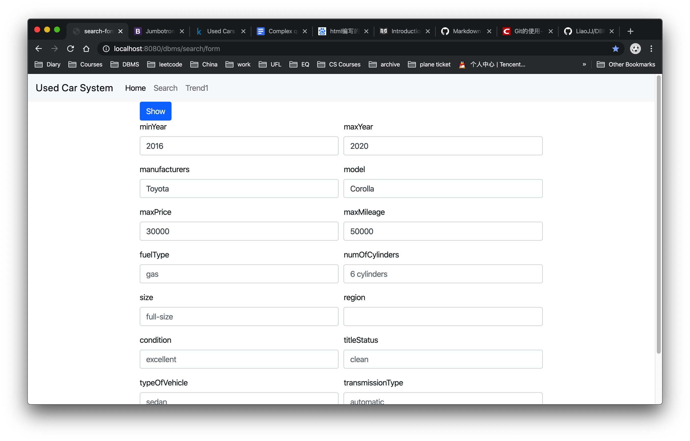
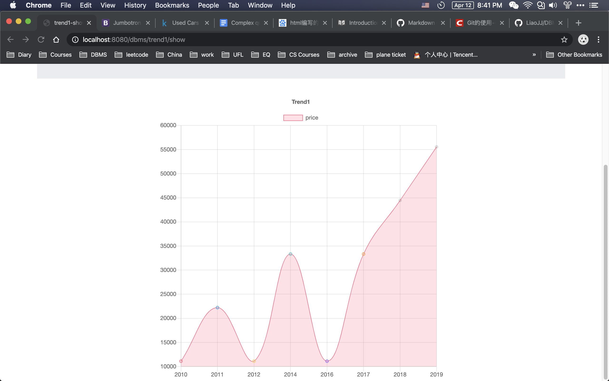
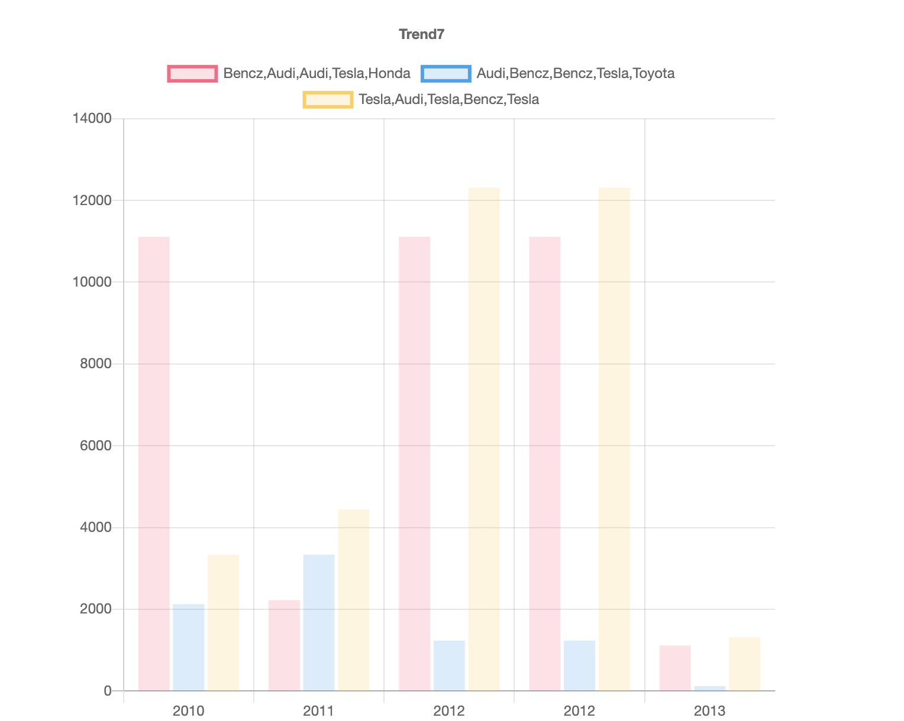

## COP 5725 Database Management Project: Used Car Management System

## https://dbms-jiajing.herokuapp.com/showamount

In this project, we build a used car management system, we grab the data from [Used Cars Dataset of Kaggle](https://www.kaggle.com/austinreese/craigslist-carstrucks-data), we design the E-R diagram, UI Interface and SQL Database Schema. Then, we implement it by Java, Spring Boot and MySQL.

The concentration of this project will be displaying the insight of databases. We display 8 trending pictures using customized SQL query to display some useful insights of the data.

## Report 
This is our 3 reports to this project

[Report 1: high-level design](deliverable/Design.pdf)

[Report 2: User Interface Design and ER diagram](deliverable/User%20Interface%20Design%20and%20ER%20diagram.pdf)

[Report 3: Database Schema Construction](deliverable/Database%20Schema%20Construction.pdf)

E-R Diagram


search form page


trending results





## Deployment 

https://dbms-jiajing.herokuapp.com/showamount

## steps
```
mvn clean package
docker build -t aaa
docker run -it -p 8181:8181 aaa

java -Dserver.port=8181 -jar ./target/boot-0.0.1-SNAPSHOT.jar
```


## MySQL
```
show databases;
create database Mybatis;
use Mybatis;
GRANT ALL ON *.* TO 'root'@'localhost';
```

#### connect to a remote server
```
mysql --protocol=tcp --user=root --password=12345678 --host=localhost --port=3306
docker exec -i 3b83d0e6eae9 sh -c 'exec mysql -u root --password=12345678 Mybatis ' < /Users/ljj/Documents/Courses/CS/DBMS/proj/UsedCar.sql
```


#### MySQL Problems:

##### cannot connect MySQL in Docker:
need to wait for several seconds for initializing of MySQL
use a start.sh to sleep 10 seconds


##### MySQL Table Name Case Sensitive Problem:
- lower-case-table-names=1
- add above line to my.cnf file


## Docker

#### useful command
```shell script
docker rm -f $(docker ps -a -q)
docker run -d -p 3306:3306 mysql:5.7
docker run -e MYSQL_ROOT_PASSWORD=12345678 -d -p 3308:3306 mysql --lower-case-table-names=1
docker run -d -it  -e MYSQL_ROOT_PASSWORD=12345678 -e MYSQL_DATABASE=Mybatis mysql:5.7 --lower-case-table-names=1
docker exec -it ea855b511660 /bin/bash
```

## Heroku

#### how to publish them to heroku: 

https://devcenter.heroku.com/articles/container-registry-and-runtime
```
heroku container:push web
heroku container:release web
heroku open
heroku logs --tail
```


#### How to bind the port 
- application.properties: server.port=${PORT: 8181}
- Dockerfile: CMD ["java","-jar", "/app.jar", "--server.port=${PORT:8181}"]

since heroku requires 60s to bind the port, however, the slow start of spring boot may exceed this time, below operations may be heliful
1. open https://dashboard.heroku.com/apps/dbms-jiajing/resources
2. close the project
3. reopen the project

Below line means success, but it still may exceeds 60 seconds limit, so try more times.
```
java -jar /app.jar --server.port\=\$\{PORT:8181\}
```

#### Volume exceed problem:
MySQL: tailor the database to 1/4 size
Heroku: it still work though memory exceeds


## Deployment PLAN

### PLAN A: push spring-boot application, buy a extra service for MySQL
too expensive, only support 5MB data

#### Free Online MySQL
ClearDB only 5 MB, tailor my Database and then insert into ClearDB, works good
db4free, 200MB, but cannot set lower-case-table-names
Remote MySQL, 100MB, but cannot set lower-case-table-names
Amazon RD, not free
Google SQL, not free
Build by Heroku, complex and cost dyno time


#### PLAN B: put spring-boot and mysql in 1 container
cannot start mysql

use a start.sh, still cannot

use another abc.sh in background with sleep(delay), solved, but cannot deployed to Heroku. Since it requires ${PORT} binding, and this binding can only happen in CMD of Dockerfile, so it's impossible to deploy

solutions:
- understand how to start mysqld in shell
- quit this problem and adopt Plan A. don't waste time.


#### PLAN C: put spring-boot and mysql in 2 seperate container

how to connect them: docker network, docker-compose
    - docker-compose: connect 2 container in local, but cannot in heroku
    - heroku.yml, very hard to learn

how to connect them in heroku, not solved, don't waste time
- tried heroku container:push --recursive, push both web and db, however, it's still not working


Future:

- Input Data is static, it should be dynamically crawlered from some website
- Add ElasticSearch full-text search
- design RESTful API
- seperate Frontend and Backend, communicate by JSON data


## Version:
- spring-boot:2.2.5
- mysql:5.7 (clearDB) 
- openjdk:8-jre-alpine
- Thymeleaf
- bootstrap
- html
- css


(This project was originally based on Oracle Database, then I modified it to MySQL for cheaper deployment.
)

## history


#### Apr 17 2:03 am

- add Trend 8

#### Apr 17 12:40 am

- finish Trend Page 2-7 form and show
- use various Chart type to display the data: line, bar, dashed, filled, displayLine

```$xslt
http://localhost:8080/dbms/trend2/form
http://localhost:8080/dbms/trend2/show

to

http://localhost:8080/dbms/trend7/form
http://localhost:8080/dbms/trend7/show
```
#### Apr 12 8:43 pm


finish 4 url for testing

search form, search show
trend1 form, trend1 show
```
http://localhost:8080/dbms/search/form
http://localhost:8080/dbms/search/show
http://localhost:8080/dbms/trend1/form
http://localhost:8080/dbms/trend1/show
```
